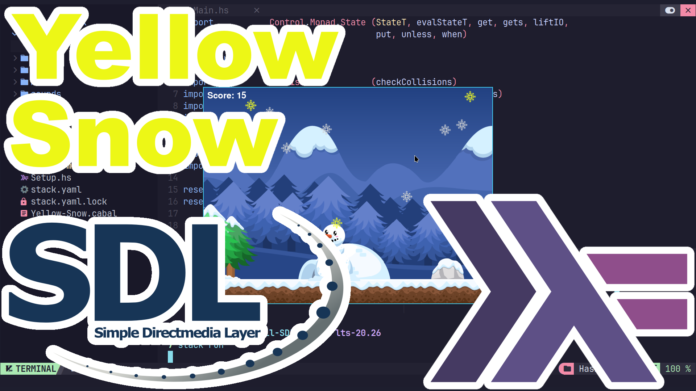

# Don't Eat the Yellow Snow! (Haskell - SDL2)
Earn points by collecting all the tasty white snow flakes that fall. But watch out for the yellow snow.

## Build and Run
You will need to make sure stack is installed.

ArchLinux instructions.
```
sudo pacman -S --needed stack
cd
git clone https://github.com/ProgrammingRainbow/Yellow-Snow-Haskell-SDL2
cd Yellow-Snow-Haskell-SDL2
stack run
```
# Controls
Left Arrow - Moves left.\
Right Arrow - Moves right.\
Space Bar - Resets the Game.\
F - Toggles Show FPS.\
M - Toggles Music.\
Escape - Quits and closes game.
